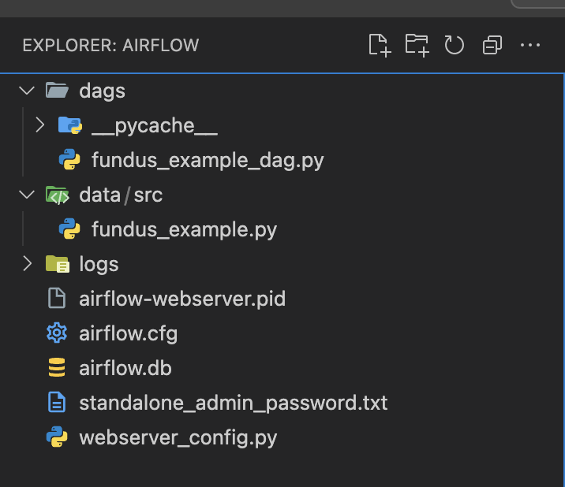

# Airflow (StandAlone)

## Simple is the best

```
pip install apache-airflow
airflow initdb
```

```
airflow standalone
```

```
mkdir -p ~/airflow/dags
```

```
mv test_dag.py ~/airflow/dags/test_dag.py
```


RECOMMENDED TO USE THE DEFAULT ADMIN AND PASSWORD WHICH GENERATED FOR YOU
```
airflow users create \
    --username kenchu \
    --password kenchu \
    --firstname FirstName \
    --lastname LastName \
    --role Admin \
    --email example@example.com
```

```
export AIRFLOW_HOME="/????/????/airflow" # your airflow path
```

IN MY CASE: 
```
export AIRFLOW_HOME="/Users/chutszkan/airflow"
airflow dags list # you can see your dag file here/
```

you may need to delete the logs in airflow:
`/Users/????/airflow/test_dags`

```
airflow standalone
```


You can login Airflow UI via username and password.

In my testing:

Once you update the DAG, seems you need to restart your `airflow standalone` 

---

However, the better way is to create the docker image to execute the script.

But, at this stage, we use local airflow to run the task which execute the python script in data/src

However, please move the dag file and `folder - data` to your AIRFLOW_HOME

