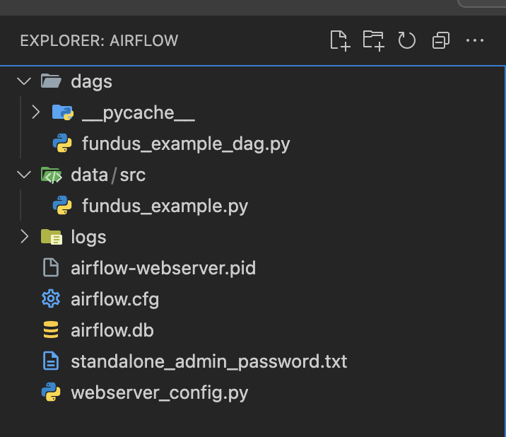

# Airflow Standalone Experiment

This note documents the local Airflow standalone experiment. It is not required for the main LLM-NewsHub demo.

## Setup

```bash
pip install apache-airflow
airflow initdb
```

```bash
airflow standalone
```

```bash
mkdir -p ~/airflow/dags
```

```bash
cp infrastructure/airflow-demo/Standalone-Airflow/dags/fundus_example_dag.py ~/airflow/dags/
```


Use the generated Airflow standalone admin credentials, or create a local user with placeholder values:

```bash
airflow users create \
    --username admin \
    --password your-local-password \
    --firstname FirstName \
    --lastname LastName \
    --role Admin \
    --email example@example.com
```

```bash
export AIRFLOW_HOME="$HOME/airflow"
airflow dags list
```

If local DAG state becomes stale during development, clear the relevant files under your local `AIRFLOW_HOME`.

```bash
airflow standalone
```


You can log in to the Airflow UI with the local username and password.

## Development Notes

During testing, DAG changes sometimes required restarting `airflow standalone`.

---

For a more production-like setup, package each pipeline step into Docker images or call the maintained `pipeline/run.py` entrypoint from Airflow tasks. This folder keeps the simpler local experiment for reference.

