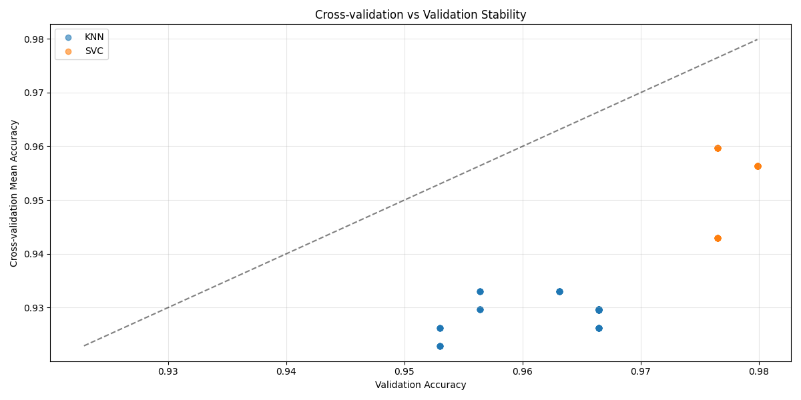

# Report

## Step0: Classifier

### Category Classification

```bash
python classifier/category/run_pipeline.py --test "classifier/category/dataset/BBC_News_Test.csv" --train "classifier/category/dataset/BBC_News_Train.csv"
```

- Model: TD-IDF + SVC

- Dataset: [LINK](classifier/category/dataset/schemas.md)

- Description: TF-IDF vectorization to convert text into numerical features, then employs Support Vector Classification (SVC) with linear kernel and hyperparameter tuning to classify articles into five categories: business, entertainment, politics, sport, and tech.

```
SVC Performance: Best accuracy: 97.99% (0.9798657718120806); Mean accuracy: 97.85% (0.9785157756692128); CV stability: 97.57% (0.9757039788603026)
KNN Performance: Best accuracy: 96.64% (0.9664429530201343); Mean accuracy: 96.23% (0.9622641509433965); CV stability: 96.68% (0.9667871229080056)
```



- Reason: TD-IDF: transforming text into meaningful numerical features; SVC: Margin Maximization Principle, More Robust, good for the high noise data compared to KNN.

### Fake News Detection

```bash
python classifier/fake_news/run_pipeline.py 
```

- Dataset: [LINK](classifier/fake_news/dataset/schemas.md)

- Model: Random Forest

- Description: Multi-feature ensemble approach combining sentiment analysis (VADER and TextBlob), linguistic features (text entropy, unique word ratio, URL count), and statistical patterns to detect fake news. The system uses Random Forest with 200 estimators, balanced class weights, and hyperparameter optimization to classify articles as real or fake news.  

- Reason: we want to use random forest to find the some pattern of the fake news according to sentisement or content pattern. And this model did not include any text length because we hope this model can be used in small content such as social media content and also large content like the news article.

## Step1: Scraping

```bash
os.system(f"python scrapers/fundus/scraper.py --date {today}")
os.system(f"python scrapers/reddit/scraper.py")
```

## Step2: Generating Card

```bash
os.system(f"python card/event/process.py --date {today}")
os.system(f"python card/statement/process.py --date {today}")
```

Description: 

- Model: LLM (Generate card), GLiNER (social media entity recognization)

- Event Card Idea: https://arxiv.org/pdf/2307.02839

- Event Card (News Article) Data: [LINK](card/event/schemas.md)

- Event Card (Social Media) Data: [LINK](card/statement/schemas.md)

Description: processes news articles and social media content into standardized JSON cards. For news articles, it employs LLM. For social media statements, it uses GLiNER (Generalist Language Model for Named Entity Recognition) to perform lightweight entity extraction on shorter text content. Both processes include multi-method sentiment analysis (VADER + TextBlob), engagement scoring, and trust score integration from publisher credibility databases. The output is structured JSON format optimized for web application consumption and downstream analysis workflows.

- Prompt for Event Card: [LINK](card/event/prompt.py)

## Step3: Grouping

```bash
os.system(f"python cluster/group_content.py --date {today}")
os.system(f"python cluster/regroup_with_size_limits.py --date {today}")
```

- Model: TF-IDF + K-Means Clustering 

- Description: Two-stage content clustering pipeline that groups related news articles and social media posts. Stage 1: Combines event cards (news articles) and statement cards (Reddit posts) into a unified content dataset, applies TF-IDF vectorization with bigram features, and performs K-Means clustering with automatic optimal cluster number selection using silhouette score, inertia, and cluster size variance metrics. Stage 2: Post-processing step that splits oversized groups (>50 items) into smaller subgroups using sub-clustering to maintain manageable group sizes for downstream article generation. The system generates performance analysis plots and rejects groups without event content to ensure quality.

- Reason: TF-IDF: Similar to previous. K-Means: Efficient clustering algorithm suitable for high-dimensional text vectors, provides interpretable group assignments, and enables automatic optimal cluster number detection through performance metrics. 

- Reason2: for the next step: we need to put the same group data to LLM to generate the news content, however, if there is too much content, LLM will exceed the max tokens. 

## Step4: Content Generation

```bash
os.system(f"python generate_article/generate_data.py --date {today}")
os.system(f"python generate_article/generate_article.py --date {today}")
os.system(f"python generate_article/gather_resource.py --date {today}")
os.system(f"python generate_article/category_arrange.py --date {today}")
```

Description: Mainly the data engineering work, find out the all resources including events, posts, comments. And we need to gather all resource of this generated content to a folder for the future work.

Generate Prompt: [LINK](generate_article/prompt.py)

Generated Content Schema can also see in the prompt ! 

## Step5: Deployment

```bash
os.system(f"python deployment/image/main.py --date {today}")
os.system(f"python deployment/audio/main.py --date {today}")
os.system(f"python migrate.py --date {today}")
os.system(f"bash alibaba-cloud/execute.bash")
```

Description: For deployment, 

- Content:

There are many metrics and score we prepared like country reliability, however, finally we use the LLM to summaries it, and only keep a few metrics like `reliability score`.

Also, there is the challenge that even our model in the dataset has close to 80% accuracy and if the fake probability is above 90% in the model, it is 100%. But, in reality data, it seems the score only can be reference.

- image will use `Stable Diffusion` to generate the image, model: `v1-5-pruned.ckpt`

- audio will be generated by: Try: `Microsoft Edge TTS` > `Google TTS` > `macOS Say`

- video, for the first human face video is generated by (https://github.com/MiniMax-AI/MiniMax-MCP) then, we use Wav2Lip to combine the audio (https://github.com/Rudrabha/Wav2Lip)

## Step6: Evaluation

```bash
os.system(f"python evaluate/evaluate.py --date {today}")
```

Evaluation Prompt: [LINK](evaluate/prompt.py)

USE LLM model ` Alibaba Qwen-Max-Latest` to evaluate
- Coherence
- Factual Accuracy
- Writing Quality
- Completeness
- Bias Neutrality
according to the generated content and the sources of generated content.

Other ML:
- Text Length 
- Flesch Reading Ease, Flesch-Kincaid Grade, Coleman-Liau Index
```python
from textstat import flesch_reading_ease, flesch_kincaid_grade, coleman_liau_index
```
- Sentisement
- Fake News Probability (according to our model)
- Similarity with the sources of generated content


